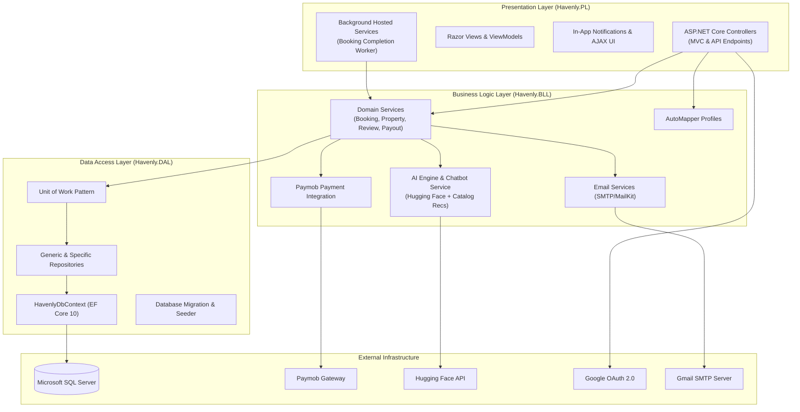
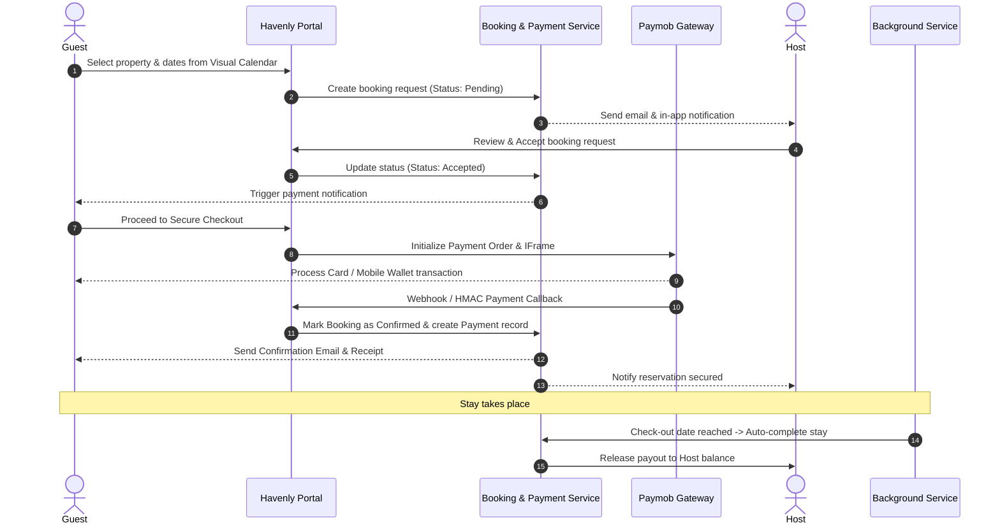
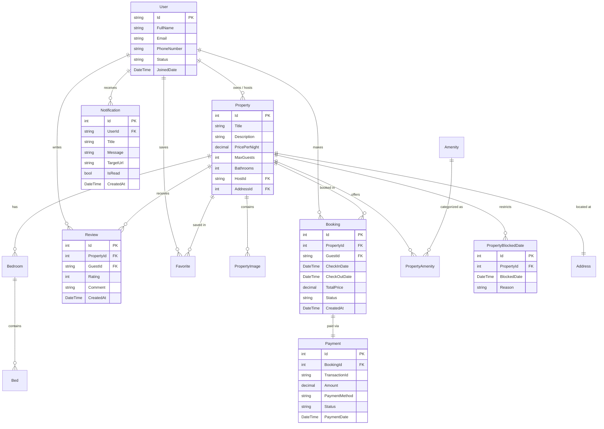

# 🏡 Havenly — Modern Vacation Rental & Accommodation Marketplace

[](https://dotnet.microsoft.com/)
[](https://learn.microsoft.com/dotnet/csharp/)
[](https://learn.microsoft.com/ef/core/)
[](https://www.microsoft.com/sql-server)
[](https://getbootstrap.com/)
[](LICENSE)

> **Havenly** is an end-to-end accommodation booking and vacation rental platform built with ASP.NET Core 10, Clean N-Tier Architecture, and modern web technologies. It seamlessly connects travelers (Guests) with property owners (Hosts), featuring interactive visual calendars, integrated payments, AI-assisted recommendations, automated notifications, and comprehensive administrative analytics.

---

## 📑 Table of Contents

- [Key Highlights & Features](#-key-highlights--features)
  - [Guest Experience](#1-guest-experience)
  - [Host Experience](#2-host-experience)
  - [Admin Dashboard & Operations](#3-admin-dashboard--operations)
  - [Cross-Platform Intelligence](#4-cross-platform-intelligence)
- [System Architecture](#-system-architecture)
- [Booking & Payment Flow](#-booking--payment-flow)
- [Entity Relationship Diagram (ERD)](#-entity-relationship-diagram-erd)
- [Technology Stack](#-technology-stack)
- [Project Directory Structure](#-project-directory-structure)
- [Getting Started](#-getting-started)
  - [Prerequisites](#prerequisites)
  - [Configuration](#configuration)
  - [Database Migration & Seeding](#database-migration--seeding)
  - [Run the Application](#run-the-application)
- [Testing](#-testing)
- [Contributing & Team](#-contributing--team)

---

## 🌟 Key Highlights & Features

### 1. Guest Experience
- **Smart Search & Advanced Filtering**: Filter listings by destination, dates, guest count, price range, property types, and specific amenities (Wi-Fi, pool, pet-friendly, etc.).
- **Interactive Visual Calendar**: Dynamic month-by-month calendar displaying real-time availability, booked dates, and host-blocked dates with clear visual indicators.
- **Wishlist & Favorites**: Save dream stays to personalized collections with single-click favoriting.
- **Instant & Safe Payments**: Seamless checkout via **Paymob Payment Gateway** (credit/debit cards and mobile wallets).
- **Reviews & Ratings**: Verified guests can leave ratings, detailed feedback, and review scores for properties after completing stays.
- **In-App Notification Center**: Real-time notification bell with unread badge counters, instant status updates, and deep links.

### 2. Host Experience
- **Property Listing Studio**: Multi-step wizard to list accommodations, upload high-resolution images, define bedroom/bed configurations, and specify pricing.
- **Visual Calendar & Custom Date Blocking**: Block or unblock custom date ranges with custom styling and instant availability synchronization.
- **Booking Requests Hub**: Responsive dashboard to review incoming booking requests, inspect guest profiles, check stay durations, and accept or decline requests.
- **Automated Host Payouts**: Real-time payout tracking and status management for completed reservations.

### 3. Admin Dashboard & Operations
- **Executive Analytics**: Visual performance metrics, drill-down charts for platform revenue, reservation trends, and platform fee collection.
- **Listing Moderation**: Inspect, approve, reject, or suspend property listings.
- **User & Role Management**: Manage user accounts, host verifications, account statuses, and roles with audit history.
- **Financial Controls**: Process payouts, manage platform commission fees, and review transaction logs.

### 4. Cross-Platform Intelligence
- **AI Recommendation Engine**: Intelligent recommendation pipeline matching travelers to properties based on preferences and natural language queries.
- **Smart Chatbot**: Integrated AI assistant powered by Hugging Face LLM models to provide 24/7 guest support and answer inquiries.
- **Automated Background Workers**: Hosted background services (`BookingCompletionBackgroundService`) running scheduled tasks to automatically mark completed stays.
- **Transactional Email System**: Responsive HTML email templates for booking confirmations, password resets, host request notifications, and receipts.

---

## 🏛 System Architecture

Havenly is architected following **Clean N-Tier Architecture** and Domain-Driven Design (DDD) principles to ensure strict separation of concerns, high maintainability, and testability.



---

## 🔄 Booking & Payment Flow



---

## 🗄 Entity Relationship Diagram (ERD)



---

## 💻 Technology Stack

| Layer | Technologies & Libraries |
| :--- | :--- |
| **Framework** | ASP.NET Core 10.0 (C# 13) |
| **Architecture** | Clean Architecture (DAL, BLL, PL) with Repository & Unit of Work Patterns |
| **Database & ORM** | Microsoft SQL Server, Entity Framework Core 10.0 |
| **Security & Identity** | ASP.NET Core Identity, Role-Based Access Control (Admin, Host, Guest), Google OAuth2 |
| **Frontend** | Razor Views, Bootstrap 5.3, FontAwesome, Chart.js, HTML5/CSS3, JavaScript (ES6+ AJAX) |
| **Payment Gateway** | Paymob API (Credit Cards, Mobile Wallets, HMAC callback validation) |
| **Artificial Intelligence** | Hugging Face Inference API (`Qwen/Qwen2.5` / `Llama-3.2`), Custom Content-Based Recommendation Engine |
| **Mailing & Comms** | MailKit & MimeKit (SMTP Google relay, Responsive HTML templates) |
| **Object Mapping** | AutoMapper 16.2 |
| **Background Processing** | ASP.NET Core Hosted Background Services |
| **Testing** | xUnit, Moq, FluentAssertions |

---

## 📁 Project Directory Structure

```text
Havenly/
├── Havenly.DAL/                    # Data Access Layer
│   ├── Database/                   # HavenlyDbContext, Migrations, DatabaseSeeder
│   ├── Entities/                   # Domain Entities (Property, Booking, User, etc.)
│   └── Repos/                      # Repositories & Unit of Work (Abstractions & Impl)
│
├── Havenly.BLL/                    # Business Logic Layer
│   ├── ModelVMs/                   # DTOs, ViewModels & Request Models
│   ├── Mappers/                    # AutoMapper Profile Configurations
│   └── Services/                   # Domain Services (Booking, Calendar, Payment, AI)
│
├── Havenly.PL/                     # Presentation Layer (Web Application)
│   ├── BackgroundServices/         # Background Hosted Services
│   ├── Controllers/                # MVC & API Controllers
│   ├── Views/                      # Razor Views (Host, Guest, Admin, Account)
│   ├── wwwroot/                    # Static Assets (CSS, JS, Images, Icons)
│   ├── appsettings.json            # Configuration settings & Connection Strings
│   └── Program.cs                  # Dependency Injection & Middleware Pipeline
│
├── Havenly.BLL.Tests/              # Unit & Integration Tests for Business Services
└── Havenly.DAL.Tests/              # Data Access & Repository Unit Tests
```

---

## 🚀 Getting Started

### Prerequisites
- [.NET 10.0 SDK](https://dotnet.microsoft.com/download/dotnet/10.0)
- [Microsoft SQL Server](https://www.microsoft.com/sql-server/) (or LocalDB / Docker container)
- Git

### Configuration
Update `Havenly.PL/appsettings.json` with your environment credentials:

```json
{
  "ConnectionStrings": {
    "DefaultConnection": "Server=localhost;Database=HavenlyDb;Trusted_Connection=True;TrustServerCertificate=True;"
  },
  "Authentication": {
    "Google": {
      "ClientId": "YOUR_GOOGLE_CLIENT_ID",
      "ClientSecret": "YOUR_GOOGLE_CLIENT_SECRET"
    }
  },
  "Paymob": {
    "ApiKey": "YOUR_PAYMOB_API_KEY",
    "IntegrationId": "YOUR_INTEGRATION_ID",
    "IframeId": "YOUR_IFRAME_ID",
    "HmacSecret": "YOUR_HMAC_SECRET",
    "IsTestMode": true
  },
  "EmailSettings": {
    "SmtpServer": "smtp.gmail.com",
    "Port": 587,
    "SenderEmail": "your-email@gmail.com",
    "SenderPassword": "your-app-password",
    "SenderDisplayName": "Havenly"
  },
  "HuggingFace": {
    "ApiKey": "YOUR_HUGGINGFACE_API_KEY",
    "ApiEndpoint": "https://router.huggingface.co/v1/chat/completions",
    "Model": "Qwen/Qwen2.5-Coder-32B-Instruct"
  }
}
```

### Database Migration & Seeding
The application automatically applies EF Core migrations and seeds foundational roles, permissions, and initial data on startup.

If you prefer to apply migrations manually via CLI:
```bash
dotnet ef database update --project Havenly.DAL --startup-project Havenly.PL
```

### Run the Application
```bash
# Navigate to the presentation project
cd Havenly.PL

# Restore and run
dotnet restore
dotnet run
```
Open your browser at `http://localhost:5071` (or the configured port).

---

## 🧪 Testing

Run the automated test suites using the .NET CLI:

```bash
# Run all tests across the solution
dotnet test

# Run BLL service tests specifically
dotnet test Havenly.BLL.Tests

# Run repository tests
dotnet test Havenly.DAL.Tests
```

---

## 👥 Contributing & Team

Developed as an **Information Technology Institute (ITI) Graduation Project**.

- **Repository**: [https://github.com/yousef8902/Havenly](https://github.com/yousef8902/Havenly)
- **License**: MIT License - see the [LICENSE](LICENSE) file for details.
